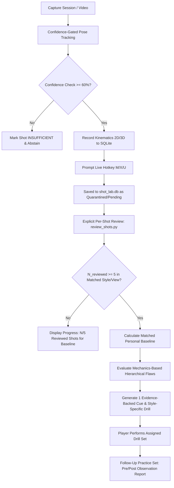

# Phase 4 — Personal Shot Lab: Context & Architecture Decisions

## 1. Phase Objective

Transform the validated, confidence-gated pose and kinematic pipeline from Phase 3 into an individualized, evidence-backed **Personal Shot Lab**. Enable players to conduct repeatable practice experiments on their own shooting mechanics, compare made vs. missed shots using descriptive associations, and receive a single, high-impact biomechanical coaching cue paired with a specific drill.

---

## 2. Locked Architecture & Implementation Decisions

### 2.1 Shot Outcome Labeling, Quarantine & Review Queue (Explicit Per-Shot Review)
- **Live In-Session Labeling:**
  - Hotkeys active during capture: `M` (Make), `X` (Miss), `U` (Unknown / Ball deflected / Unclear).
  - On shot release/detection, the HUD renders a non-blocking 2.5-second overlay displaying the detected shot metrics and prompt: `[M] Make | [X] Miss | [U] Unknown`.
  - Pressing a hotkey stamps the current active shot record immediately with `outcome_label` and `outcome_source: "live_hotkey"`.
- **Post-Session CLI Review & Explicit Per-Shot Admission (`review_shots.py`):**
  - Quarantined shots (unreviewed, ambiguous, or automatic machine detections) require explicit per-shot human review before admission into personal baselines.
  - No blind batch-approve action is permitted: each attempt's keyframes, boundaries, and confidence must be reviewed individually before approving, relabeling, or discarding it.
  - Interactive scrubbing through keyframes (Dip -> Set-Point -> Release -> Follow-Through).
  - Allows human operators to override detected event boundaries (frame timestamps), correct outcomes, or mark tracking quality as insufficient.
  - **Strict Provenance Rule:** The database preserves both machine-detected boundaries (`machine_*_frame`) and human-corrected boundaries (`annotated_*_frame`), tracking `last_modified_timestamp` without destroying machine predictions.

### 2.2 Cue Prioritization & Remediation Engine (Mechanics-Based Gating)
- **Mechanics Thresholds over 1-Sigma Gating:**
  - With small samples, single standard-deviation make/miss differences are noisy and vulnerable to random variation.
  - Cues are triggered when a biomechanical flaw repeats across reviewed shots against configurable mechanics thresholds, rather than relying on a make-vs-miss difference.
  - Make vs. miss comparisons serve as descriptive context, never as proof that a mechanic caused an outcome.
  - Contrast reporting between makes and misses is activated only when both groups have adequate sample sizes ($N_{\text{makes}} \ge 5$ and $N_{\text{misses}} \ge 5$).
- **One-Cue Rule & Priority Hierarchy:**
  1. **Kinetic Sequencing Flaw (Highest Priority):**
     - Condition: Knee extension peak to elbow extension peak lag $\Delta t > 100\text{ms}$ or out-of-order sequence (e.g. elbow extends before knee drives).
     - Associated Coaching Concept: Energy transfer efficiency from lower to upper body.
     - Recommended Drill: *One-Motion Dip-to-Rise Wall/Rim Jumps (10 reps)* (jump shot) or *Continuous Flow One-Motion Rhythm Shooting (15 reps)* (set shot).
  2. **Release Extension & Height Flaw (Second Priority):**
     - Condition: 3D world elbow extension at release $< 150^\circ$ (configurable per style).
     - Associated Coaching Concept: Arc trajectory consistency and repeatable release point.
     - Recommended Drill: *High-Release Form Shooting from 5 Feet (15 reps)*.
  3. **Set-Point Dip Stability & Posture (Third Priority):**
     - Condition: Excessive torso sway ($> 12^\circ$) or unstable elbow tuck angle during dip.
     - Associated Coaching Concept: Base balance and shot alignment.
     - Recommended Drill: *Chair/Stance Holds into Balanced Catch-and-Shoots (10 reps)*.
  *Rule: The system displays at most ONE primary coaching cue at any given time to prevent cognitive overload.*

### 2.3 Shot-Style Differentiation (`jump_shot` vs `set_shot`)
- **Separate Configurable Thresholds & Drills:**
  - `jump_shot`: Elevated set point (forehead level), release near apex, higher elbow extension threshold ($\ge 150^\circ$), drills emphasize vertical timing and jump synchronization.
  - `set_shot`: Lower set point (shoulder/chin level), continuous upward energy push, drills emphasize fluid ground-force transfer and one-motion release.
- **Context Isolation:** Every shot records `shot_style`. Baselines are computed strictly within matching `(player_id, camera_view, shot_type, shot_style)`. Baselines are never compared across styles.
- **Starting Defaults:** Documented thresholds and drill pairings are starting empirical defaults to evaluate, not dogmatic coaching truths.

### 2.4 Follow-Up Comparison Architecture (Observational, No Combined Score)
- **Observational Follow-Up Report:**
  - No synthetic combined "improvement score".
  - Reports pre-drill vs. post-drill sample sizes ($N_{\text{pre}}$, $N_{\text{post}}$).
  - Reports sample mean and sample standard deviation ($\bar{x} \pm s$) for the targeted metric.
  - Reports make percentage change with explicit numerator and denominator (e.g. Pre: $3/6$ (50.0%) $\to$ Post: $5/6$ (83.3%)).
  - Records whether the assigned drill was completed (`drill_completed: bool`).
  - Restricts comparison to reviewed shots from the same player, camera view, shot type, and shot style.
  - Language is strictly observational ("Observed post-drill session showed...", "Observed change:"), never causal ("drill caused", "improved due to").

### 2.5 Persistence & Storage Engine (`shot_lab.db`)
- **Engine:** SQLite database using Python's standard `sqlite3` module.
- **Location:** `shot_lab.db` located in the project root with versioned schema (`schema_version = 1`).
- **Core Tables:**
  - `players`: `player_id`, `name`, `height_m`, `wingspan_m`, `created_at`.
  - `sessions`: `session_id`, `player_id`, `camera_view`, `shot_type`, `shot_style`, `fps`, `model_version`, `timestamp`.
  - `shots`: `shot_id`, `session_id`, `player_id`, `camera_view`, `shot_type`, `shot_style`, machine boundaries (`machine_*`), human annotations (`annotated_*`), `outcome`, `outcome_source`, `review_status` (`"quarantined"`, `"approved"`, `"discarded"`), `tracking_confidence`, 3D kinematics, 2D kinematics, `sequence_lag_ms`, `torso_sway_deg`.
  - `baselines`: `baseline_id`, `player_id`, `camera_view`, `shot_type`, `shot_style`, `sample_size_makes`, `sample_size_misses`, `sample_size_total`, kinematic means and sample standard deviations, `computed_at`.
  - `remediations`: `remediation_id`, `player_id`, `baseline_id`, `shot_style`, `targeted_flaw`, `recommended_drill`, `drill_completed`, pre/post metric statistics, make percentage tracking.

### 2.6 Evidence Framing & Ground Truth Boundaries
- **Benchmark Coverage Scoping:** Across the 15 raw clips (12,394 frames) evaluated in Phase 3, MediaPipe pose tracking was verified on 100% of frames. However, reference human ground-truth annotations exist for only 3 clips covering 5 shots.
- Therefore, event boundary accuracy is established on that specific labeled subset; the quarantine count reflects automated filter categorization rather than manual post-session review.
- Phase 4 treats unreviewed machine detections as quarantined until explicit per-shot human review is performed.

---

## 3. Practice Experiment Workflow

---

## 4. Scope Guardrails & Deferred Features

- **In-Scope for Phase 4:**
  - SQLite schema creation with `shot_style` and explicit review/quarantine statuses (`shot_lab_db.py`).
  - Integration of live outcome hotkeys (`M`/`X`/`U`) into `main.py` HUD.
  - Interactive/CLI explicit per-shot review utility without batch-approval shortcuts (`review_shots.py`).
  - Baseline calculation with style matching and sample gates ($N \ge 5$) (`baseline_engine.py`).
  - One-cue remediation engine with mechanics-based triggers and style-specific drills (`coach_engine.py`).
  - Follow-up evaluation with pre/post sample counts, $\bar{x} \pm s$, and make percentage numerator/denominator.
  - End-to-end practice experiment validation test (`test_shot_lab_flow.py`).
- **Deferred to Phase 5:**
  - Streamlit multi-page web dashboard and timeline scrubber UI.
  - Coach multi-athlete roster management.
  - Export to external analytical packages (PDF/Parquet).
- **Deferred to Phase 6:**
  - Multi-camera triangulation calibration.
  - Machine-learned temporal ranking models for cue prioritization.

