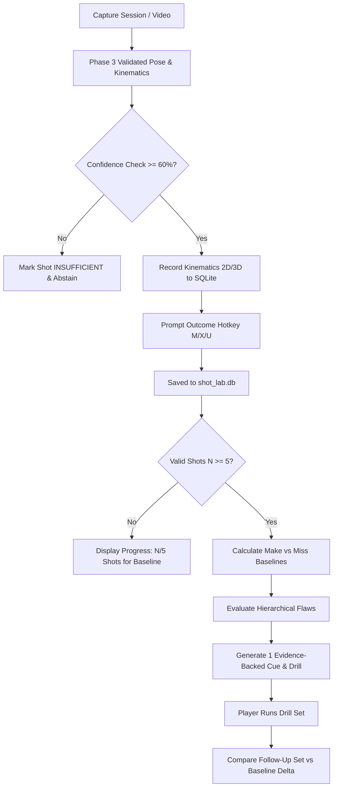

# Phase 4 — Personal Shot Lab: Context & Architecture Decisions

## 1. Phase Objective

Transform the validated, confidence-gated pose and kinematic pipeline from Phase 3 into an individualized, evidence-backed **Personal Shot Lab**. Enable players to conduct repeatable practice experiments on their own shooting mechanics, compare made vs. missed shots using descriptive associations, and receive a single, high-impact biomechanical coaching cue paired with a specific drill.

---

## 2. Locked Architecture & Implementation Decisions

### 2.1 Shot Outcome Labeling & Review Queue (Hybrid Workflow)
- **Live In-Session Labeling:**
  - Hotkeys active during capture: `M` (Make), `X` (Miss), `U` (Unknown / Ball deflected / Unclear).
  - On shot release/detection, the HUD renders a non-blocking 2.5-second overlay displaying the detected shot metrics and prompt: `[M] Make | [X] Miss | [U] Unknown`.
  - Pressing a hotkey stamps the current active shot record immediately with `outcome_label` and `outcome_source: "live_hotkey"`.
- **Post-Session CLI Review & Correction Tool:**
  - A standalone review script (`review_shots.py`) allows players/coaches to inspect session recordings or saved shots.
  - Enables scrubbing through keyframes (Dip -> Set-Point -> Release -> Follow-Through).
  - Allows human operators to override detected event boundaries (frame timestamps) and outcome labels.
  - **Strict Provenance Rule:** The database preserves both machine-detected boundaries (`machine_release_frame`) and human-corrected boundaries (`annotated_release_frame`), tracking `last_modified_timestamp` without destroying machine predictions.

### 2.2 Cue Prioritization & Remediation Engine
When multiple biomechanical flaws or differences between makes and misses are observed, the **One-Cue Remediation Engine** applies a strict hierarchical priority order:

1. **Kinetic Sequencing Flaw (Highest Priority):**
   - Condition: Knee extension peak to elbow extension peak lag $\Delta t > 100\text{ms}$ or out-of-order sequence (e.g. elbow extends before knee drives).
   - Associated Coaching Concept: Energy transfer efficiency from lower to upper body.
   - Recommended Drill: *One-Motion Dip-to-Rise Wall/Rim Jumps (10 reps)*.
2. **Release Extension & Height Flaw (Second Priority):**
   - Condition: 3D world elbow extension at release $< 150^\circ$ or release height relative to eye line $< 0.15\text{m}$.
   - Associated Coaching Concept: Arc trajectory consistency and repeatable release point.
   - Recommended Drill: *High-Release Form Shooting from 5 Feet (15 reps)*.
3. **Set-Point Dip Stability & Posture (Third Priority):**
   - Condition: Excessive torso sway ($> 12^\circ$) or unstable elbow tuck angle during dip.
   - Associated Coaching Concept: Base balance and shot alignment.
   - Recommended Drill: *Chair/Stance Holds into Balanced Catch-and-Shoots (10 reps)*.

*Rule: The system displays at most ONE primary coaching cue at any given time to prevent cognitive overload.*

### 2.3 Persistence & Storage Engine (`shot_lab.db`)
- **Engine:** SQLite database using Python's standard `sqlite3` module.
- **Location:** `shot_lab.db` located in the project root with versioned schema (`schema_version = 1`).
- **Core Tables:**
  - `players`: `player_id`, `name`, `height_m`, `wingspan_m`, `created_at`.
  - `sessions`: `session_id`, `player_id`, `camera_view` (`"frontal"`, `"side_90"`, `"oblique_45"`), `shot_type`, `fps`, `model_version`, `timestamp`.
  - `shots`: `shot_id`, `session_id`, `start_frame`, `dip_frame`, `set_frame`, `release_frame`, `end_frame`, `outcome` (`"make"`, `"miss"`, `"unknown"`), `outcome_source`, `tracking_confidence` (`"SUFFICIENT"`, `"INSUFFICIENT"`), `knee_angle_dip_3d`, `elbow_angle_release_3d`, `elbow_angle_release_2d`, `sequence_lag_ms`, `foreshortening_discrepancy_deg`, `raw_landmarks_ref`.
  - `baselines`: `baseline_id`, `player_id`, `camera_view`, `sample_size`, `mean_release_angle_make`, `mean_release_angle_miss`, `mean_sequence_lag_make`, `mean_sequence_lag_miss`, `computed_at`.
  - `remediations`: `remediation_id`, `player_id`, `targeted_flaw`, `recommended_drill`, `pre_drill_mean_metric`, `post_drill_mean_metric`, `status` (`"active"`, `"completed"`, `"dismissed"`), `feedback_notes`.

### 2.4 Baseline Semantics & Scientific Honesty
- **Minimum Sample Gate:** A player baseline requires a minimum of $N \ge 5$ valid, confidence-gated shots (`tracking_confidence == "SUFFICIENT"`) for the same camera view and shot type.
- **Descriptive Associations Only:** All differences between makes and misses must be reported as descriptive statistical associations (e.g. *"In your 8 reviewed shots, makes averaged $158^\circ \pm 4^\circ$ elbow extension compared to $142^\circ \pm 7^\circ$ on misses"*).
- **Causal Disclaimers:** Never use causal verbs like *"caused by"*, *"fixed by"*, or *"guarantees"*. Always indicate sample size $N$ and temporal measurement resolution ($\pm 33\text{ms}$ at 30 FPS).
- **Abstention Behavior:** If $N < 5$ or shots suffer from severe occlusion/dropout, the UI displays *"Baseline Pending: Insufficient valid shots ($N/5$ recorded)"*.

---

## 3. Practice Experiment Workflow

---

## 4. Scope Guardrails & Deferred Features

- **In-Scope for Phase 4:**
  - SQLite schema creation and migration helpers (`shot_lab_db.py`).
  - Integration of live outcome hotkeys (`M`/`X`/`U`) into `main.py` HUD.
  - Interactive/CLI shot review utility (`review_shots.py`).
  - Baseline calculation and Make vs. Miss statistical comparison (`baseline_engine.py`).
  - One-cue remediation engine with drill pairing (`coach_engine.py`).
  - End-to-end practice experiment validation test (`test_shot_lab_flow.py`).
- **Deferred to Phase 5:**
  - Streamlit multi-page web dashboard and timeline scrubber UI.
  - Coach multi-athlete roster management.
  - Export to external analytical packages (PDF/Parquet).
- **Deferred to Phase 6:**
  - Multi-camera triangulation calibration.
  - Machine-learned temporal ranking models for cue prioritization.
