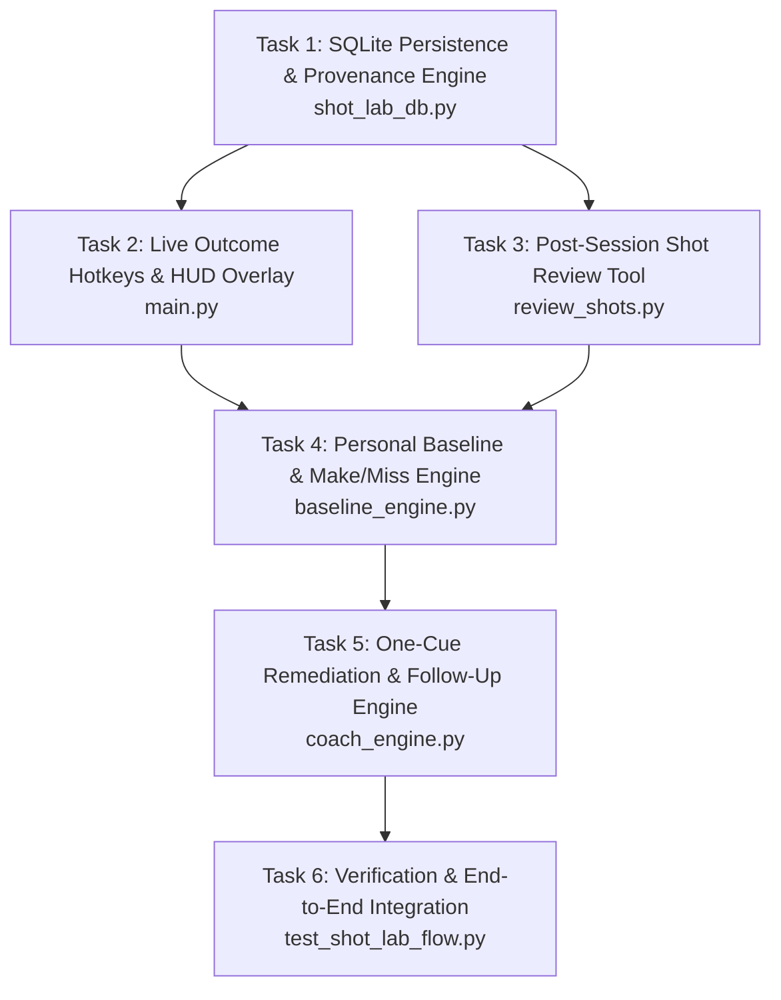

# Phase 4 — Personal Shot Lab & Evidence-Gated Coaching

**Status:** Ready for Execution (Context locked in `04-CONTEXT.md`)  
**Goal:** Transform validated pose and kinematic measurements from Phase 3 into an individualized, evidence-backed practice experiment system. Enable players to track personal baselines, compare made vs. missed shots using descriptive associations, and receive a single, high-impact biomechanical coaching cue paired with a specific drill.

---

## 1. Executive Summary & Architecture Principles

1. **Tracer-First Implementation:** Build the SQLite storage and provenance backbone first (`shot_lab_db.py`), wire it into live capture and post-session review, then implement the baseline and coaching engines on top of guaranteed data schemas.
2. **Strict Provenance & Machine/Human Separation:** Never overwrite raw machine predictions with human corrections. Persist both `machine_*_frame` and `annotated_*_frame` along with outcome origins (`live_hotkey`, `manual_review`, `unlabeled`).
3. **Statistical Honesty & $\pm$ Semantics:**
   - For continuous kinematic metrics (e.g. elbow angle, knee dip): $\bar{x} \pm s$ denotes **sample mean $\pm$ sample standard deviation** across shots (inter-shot variability).
   - For temporal lag metrics: reports $\bar{t} \pm s$ alongside **temporal quantization uncertainty** ($\pm \frac{1}{\text{FPS}} = \pm 33.3\text{ms}$ at 30 FPS).
   - Minimum sample gate: $N \ge 5$ confidence-gated valid shots (`tracking_confidence == "SUFFICIENT"`) for the same camera view and shot type.
   - Descriptive associations only (*"associated with"*, *"observed in your $N$ makes"*); zero unvalidated causal claims.
4. **Cognitive Simplicity:** Enforce the **One-Cue Rule**—the remediation engine selects and presents exactly one prioritized flaw at a time.
5. **Separation of Evidence:** Laboratory/field accuracy remains gated on Phase 3 reference annotations; Personal Shot Lab operates as an individualized practice experiment without claiming universal NBA ground truth.

---

## 2. Work Breakdown & Task Sequence

---

### Task 1: SQLite Persistence & Provenance Schema (`shot_lab_db.py`)
- **Objective:** Create a robust, versioned SQLite database layer to store players, sessions, raw/calibrated kinematics, machine vs. human annotations, baselines, and drill remediations with explicit `shot_style` support.
- **Files to modify:** `shot_lab_db.py`
- **Schema Details (`schema_version = 1`):**
  - `players`: `player_id TEXT PRIMARY KEY`, `name TEXT`, `height_m REAL`, `wingspan_m REAL`, `created_at TIMESTAMP`.
  - `sessions`: `session_id TEXT PRIMARY KEY`, `player_id TEXT`, `camera_view TEXT` (`"frontal" | "side_90" | "oblique_45"`), `shot_type TEXT` (`"catch_and_shoot" | "off_dribble" | "free_throw"`), `shot_style TEXT` (`"jump_shot" | "set_shot"`), `fps REAL`, `model_version TEXT`, `created_at TIMESTAMP`.
  - `shots`:
    - `shot_id TEXT PRIMARY KEY`, `session_id TEXT`, `player_id TEXT`, `camera_view TEXT`, `shot_type TEXT`, `shot_style TEXT`
    - Machine boundaries: `machine_start_frame INT`, `machine_dip_frame INT`, `machine_set_frame INT`, `machine_release_frame INT`, `machine_end_frame INT`
    - Human-annotated boundaries: `annotated_start_frame INT`, `annotated_dip_frame INT`, `annotated_set_frame INT`, `annotated_release_frame INT`, `annotated_end_frame INT`
    - Outcome: `outcome TEXT` (`"make" | "miss" | "unknown"`), `outcome_source TEXT` (`"live_hotkey" | "manual_review" | "unlabeled"`), `review_status TEXT` (`"quarantined" | "approved" | "discarded"`), `review_notes TEXT`
    - Tracking validity: `tracking_confidence TEXT` (`"SUFFICIENT" | "INSUFFICIENT"`), `valid_frame_ratio REAL`
    - 3D World Kinematics: `knee_angle_dip_3d REAL`, `elbow_angle_release_3d REAL`, `release_height_rel_m REAL`
    - 2D Image Kinematics: `elbow_angle_release_2d REAL`, `foreshortening_discrepancy_deg REAL`
    - Sequencing: `sequence_lag_ms REAL`, `sequence_order_valid BOOLEAN`, `torso_sway_deg REAL`
    - Metadata: `created_at TIMESTAMP`, `updated_at TIMESTAMP`
  - `baselines`: `baseline_id TEXT PRIMARY KEY`, `player_id TEXT`, `camera_view TEXT`, `shot_type TEXT`, `shot_style TEXT`, `sample_size_makes INT`, `sample_size_misses INT`, `sample_size_total INT`, `mean_elbow_release_make REAL`, `std_elbow_release_make REAL`, `mean_elbow_release_miss REAL`, `std_elbow_release_miss REAL`, `mean_sequence_lag_make REAL`, `std_sequence_lag_make REAL`, `mean_sequence_lag_miss REAL`, `std_sequence_lag_miss REAL`, `mean_elbow_release_all REAL`, `std_elbow_release_all REAL`, `mean_sequence_lag_all REAL`, `std_sequence_lag_all REAL`, `computed_at TIMESTAMP`.
  - `remediations`: `remediation_id TEXT PRIMARY KEY`, `player_id TEXT`, `baseline_id TEXT`, `shot_style TEXT`, `targeted_flaw TEXT`, `priority_tier INT`, `recommended_drill TEXT`, `drill_reps INT`, `drill_completed BOOLEAN`, `pre_drill_metric_mean REAL`, `pre_drill_metric_std REAL`, `post_drill_metric_mean REAL`, `post_drill_metric_std REAL`, `pre_make_count INT`, `pre_total_count INT`, `post_make_count INT`, `post_total_count INT`, `status TEXT` (`"active" | "completed" | "dismissed"`), `feedback_notes TEXT`, `created_at TIMESTAMP`.
- **Verification:** Unit tests verifying table creation, schema version stamping, CRUD operations, and immutable machine boundary persistence.

---

### Task 2: Live In-Session Outcome Hotkeys & HUD Overlay (`main.py`)
- **Objective:** Enable frictionless live outcome tagging during live capture without interrupting video processing, persisting `shot_style` and quarantine status.
- **Files to modify:** `main.py`
- **Specification:**
  - Passes `shot_style` into `session` and `shot` records.
  - When a shot ends:
    - Display non-blocking HUD toast at the top-center:
      `[M] Make  |  [X] Miss  |  [U] Unknown  (Shot #N recorded)`
    - Active hotkeys: `m` / `M` (Make), `x` / `X` (Miss), `u` / `U` (Unknown).
    - If user presses hotkey, update shot with `outcome_source = "live_hotkey"` and mark as confirmed/reviewed.
    - If no key is pressed, persist with `outcome = "unknown"`, `outcome_source = "unlabeled"`, and `review_status = "quarantined"`.
  - Ensure all stdout and HUD rendering remains ASCII/safe on Windows `cp1252`.
- **Verification:** Video execution verifying hotkey capture, database recording with `shot_style`, and toast expiration.

---

### Task 3: Post-Session Shot Review & Explicit Per-Shot Admission Tool (`review_shots.py`)
- **Objective:** Provide a standalone CLI review queue for explicit per-shot inspection, scrubbing, and approval of quarantined shots before baseline admission. No blind batch-approval.
- **Files to modify:** `review_shots.py`
- **Specification:**
  - Explicit per-shot workflow: review keyframes and boundaries before approving, relabeling, or discarding attempts.
  - Supports filtering by session, player, and quarantine status (`--quarantined`, `--approved`).
  - Menu / CLI actions for explicit shot decision:
    - `[A]pprove Shot`: Validate boundaries/confidence and mark `review_status = "approved"` for baseline admission.
    - `[R]elabel Outcome`: Set/correct outcome to Make, Miss, or Unknown (`outcome_source = "manual_review"`).
    - `[E]dit Boundaries`: Override dip or release frame (saved in `annotated_*_frame`, preserving `machine_*_frame`).
    - `[D]iscard / Quarantine`: Flag poor tracking quality or non-shot artifacts as `review_status = "discarded"`.
    - No blind batch-approval shortcut is provided.
- **Verification:** Automated tests verifying explicit per-shot approval, boundary overriding while preserving machine columns, and rejection of batch shortcuts.

---

### Task 4: Personal Baseline & Descriptive Association Engine (`baseline_engine.py`)
- **Objective:** Calculate player-specific baseline kinematic profiles strictly grouped by `(player_id, camera_view, shot_type, shot_style)`.
- **Files to modify:** `baseline_engine.py`
- **Specification:**
  - **Context Grouping:** Strictly filters by `(player_id, camera_view, shot_type, shot_style)`. Never cross-pollinates baselines across styles.
  - **Quality & Sample Gate:**
    - Requires at least $N_{\text{valid}} \ge 5$ human-reviewed approved shots (`review_status in ('approved', 'live_hotkey')` or human-confirmed).
    - If $N < 5$, return status `"INSUFFICIENT_SAMPLE"` with progress (`"Collected N/5 reviewed shots for baseline"`).
  - **Statistical Computations:**
    - Computes sample mean $\bar{x} = \frac{1}{N}\sum x_i$ and sample standard deviation $s = \sqrt{\frac{1}{N-1}\sum (x_i - \bar{x})^2}$ across all reviewed shots.
    - Make vs. miss contrast is reported ONLY when $N_{\text{makes}} \ge 5$ and $N_{\text{misses}} \ge 5$. If either group has $< 5$ shots, reports overall baseline mechanics with note: *"Make-vs-miss contrast pending: requires >= 5 reviewed makes and >= 5 reviewed misses (found N_makes, N_misses)"*.
    - Timing metrics report $\bar{t} \pm s$ alongside temporal quantization uncertainty ($\pm 33.3\text{ms}$ at 30 FPS).
  - **Language Guardrails:** Format output strings strictly as descriptive associations (*"In your N reviewed shots, makes were associated with..."*), zero causal claims (*"caused your miss"*).
- **Verification:** Unit tests verifying $N < 5$ gate, style isolation, make/miss sub-gate ($\ge 5$ each), and $\bar{x} \pm s$ calculations.

---

### Task 5: Mechanics-Based Hierarchical One-Cue Remediation & Follow-Up Engine (`coach_engine.py`)
- **Objective:** Select the single highest-impact biomechanical flaw from repeated baseline mechanics against configurable thresholds (not a noisy 1-sigma make/miss contrast), recommend a style-specific drill, and generate an observational follow-up report without combined scores.
- **Files to modify:** `coach_engine.py`
- **Specification:**
  - **Mechanics-Based Gating:** Flaws are triggered by repeating biomechanical metrics against configurable thresholds for the specific `shot_style` (jump shot vs set shot), treating thresholds and drills as empirical starting defaults.
  - **Hierarchy:**
    1. **Tier 1 (Kinetic Sequencing):**
       - Trigger: Overall sequence lag $> 100\text{ms}$ (jump shot) or $> 85\text{ms}$ (set shot), or sequence inversion.
       - Jump Shot Drill: *One-Motion Dip-to-Rise Wall/Rim Jumps (10 reps)*.
       - Set Shot Drill: *Continuous Ground-to-Release Rhythm Shooting (15 reps)*.
    2. **Tier 2 (Release Extension & Height):**
       - Trigger: Overall release elbow angle $< 150^\circ$ (jump shot) or $< 145^\circ$ (set shot).
       - Jump Shot Drill: *High-Release Form Shooting from 5 Feet (15 reps)*.
       - Set Shot Drill: *One-Handed Form Push from 8 Feet (15 reps)*.
    3. **Tier 3 (Set-Point Stability & Posture):**
       - Trigger: Torso sway $> 10^\circ$.
       - Drill: *Balanced Catch-and-Shoot Holds (10 reps)*.
  - **One-Cue Rule:** Exactly one primary cue is returned at a time.
  - **Observational Follow-Up Report (No Combined Improvement Score):**
    - Input: Pre-drill baseline and post-drill reviewed shots from the same player, view, type, and style ($N \ge 3$).
    - Output fields:
      - Sample counts: $N_{\text{pre}}$, $N_{\text{post}}$
      - Metric statistics: $\bar{x}_{\text{pre}} \pm s_{\text{pre}}$, $\bar{x}_{\text{post}} \pm s_{\text{post}}$, and raw delta $\Delta = \bar{x}_{\text{post}} - \bar{x}_{\text{pre}}$
      - Make percentage change with explicit fractions: e.g. Pre: $3/6$ (50.0%) $\to$ Post: $5/6$ (83.3%), $\Delta = +33.3\%$
      - `drill_completed: bool`
      - Language: purely observational, no causal assertions.
- **Verification:** Unit tests verifying mechanics-based triggers, style-specific drills, and observational follow-up metrics.

---

### Task 6: End-to-End Integration & Verification Suite (`test_shot_lab_flow.py`)
- **Objective:** Validate the entire Personal Shot Lab lifecycle end-to-end.
- **Files to modify:** `test_shot_lab_flow.py`
- **Verification Workflow:**
  1. Initialize temporary SQLite database with versioned schema and `shot_style`.
  2. Ingest synthetic shots with explicit per-shot review / quarantine handling.
  3. Verify that blind batch-approval is rejected and explicit per-shot admission admits shots.
  4. Verify baseline gating requires $N \ge 5$ reviewed shots and isolates `jump_shot` from `set_shot`.
  5. Verify make-vs-miss contrast is held pending until both makes and misses have $\ge 5$ shots.
  6. Verify mechanics-based cue triggering and style-specific drill selection.
  7. Verify follow-up comparison reporting pre/post sample counts, $\bar{x} \pm s$, make percentage with numerator/denominator, and observational language.
  8. Confirm zero crashes, clean ASCII output, and full adherence to scientific integrity rules.

---

## 3. Acceptance Criteria

- [ ] **Schema & Persistence:** `shot_lab.db` stores players, sessions, shots, baselines, and remediations with separate machine vs human boundary columns.
- [ ] **Live Tagging:** Live capture HUD presents `[M] Make | [X] Miss | [U] Unknown` with non-blocking toast and records outcome source.
- [ ] **Review Queue:** `review_shots.py` allows offline scrubbing and editing of boundaries and outcomes while preserving original machine detections.
- [ ] **Baseline Engine:** `baseline_engine.py` enforces $N \ge 5$ valid shots, matches camera view and shot type, and reports $\pm s$ sample standard deviations and temporal quantization uncertainty.
- [ ] **One-Cue Engine:** `coach_engine.py` prioritizes flaws in Tier 1 $\to$ Tier 2 $\to$ Tier 3 order and outputs exactly one cue paired with a drill.
- [ ] **Follow-Up Verification:** Follow-up sessions evaluate targeted metric deltas without making causal claims.
- [ ] **Test Coverage:** `test_shot_lab_flow.py` executes and passes 100% of integration checks.

