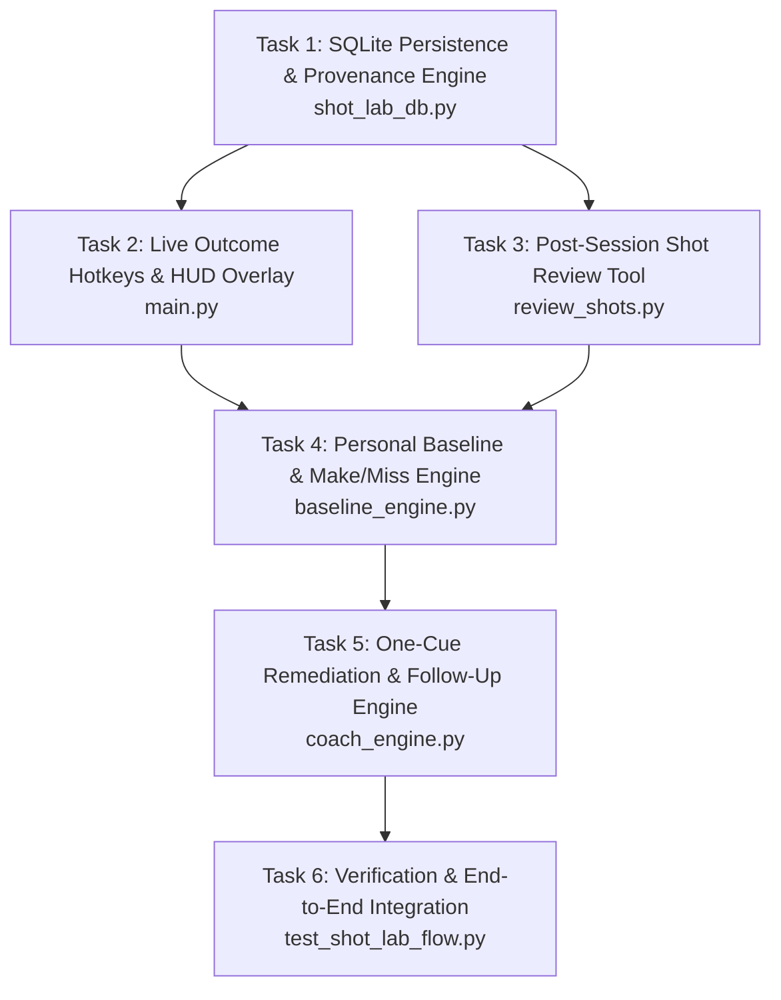

# Phase 4 — Personal Shot Lab & Evidence-Gated Coaching

**Status:** Ready for Execution (Context locked in `04-CONTEXT.md`)  
**Goal:** Transform validated pose and kinematic measurements from Phase 3 into an individualized, evidence-backed practice experiment system. Enable players to track personal baselines, compare made vs. missed shots using descriptive associations, and receive a single, high-impact biomechanical coaching cue paired with a specific drill.

---

## 1. Executive Summary & Architecture Principles

1. **Tracer-First Implementation:** Build the SQLite storage and provenance backbone first (`shot_lab_db.py`), wire it into live capture and post-session review, then implement the baseline and coaching engines on top of guaranteed data schemas.
2. **Strict Provenance & Machine/Human Separation:** Never overwrite raw machine predictions with human corrections. Persist both `machine_*_frame` and `annotated_*_frame` along with outcome origins (`live_hotkey`, `manual_review`, `unlabeled`).
3. **Statistical Honesty & $\pm$ Semantics:**
   - For continuous kinematic metrics (e.g. elbow angle, knee dip): $\bar{x} \pm s$ denotes **sample mean $\pm$ sample standard deviation** across shots (inter-shot variability).
   - For temporal lag metrics: reports $\bar{t} \pm s$ alongside **temporal quantization uncertainty** ($\pm \frac{1}{\text{FPS}} = \pm 33.3\text{ms}$ at 30 FPS).
   - Minimum sample gate: $N \ge 5$ confidence-gated valid shots (`tracking_confidence == "SUFFICIENT"`) for the same camera view and shot type.
   - Descriptive associations only (*"associated with"*, *"observed in your $N$ makes"*); zero unvalidated causal claims.
4. **Cognitive Simplicity:** Enforce the **One-Cue Rule**—the remediation engine selects and presents exactly one prioritized flaw at a time.
5. **Separation of Evidence:** Laboratory/field accuracy remains gated on Phase 3 reference annotations; Personal Shot Lab operates as an individualized practice experiment without claiming universal NBA ground truth.

---

## 2. Work Breakdown & Task Sequence

---

### Task 1: SQLite Persistence & Provenance Schema (`shot_lab_db.py`)
- **Objective:** Create a robust, versioned SQLite database layer to store players, sessions, raw/calibrated kinematics, machine vs. human annotations, baselines, and drill remediations.
- **Files to create/modify:** `shot_lab_db.py`
- **Schema Details (`schema_version = 1`):**
  - `players`: `player_id TEXT PRIMARY KEY`, `name TEXT`, `height_m REAL`, `wingspan_m REAL`, `created_at TIMESTAMP`.
  - `sessions`: `session_id TEXT PRIMARY KEY`, `player_id TEXT`, `camera_view TEXT` (`"frontal" | "side_90" | "oblique_45"`), `shot_type TEXT` (`"catch_and_shoot" | "off_dribble" | "free_throw"`), `fps REAL`, `model_version TEXT`, `created_at TIMESTAMP`.
  - `shots`:
    - `shot_id TEXT PRIMARY KEY`, `session_id TEXT`, `player_id TEXT`
    - Machine boundaries: `machine_start_frame INT`, `machine_dip_frame INT`, `machine_set_frame INT`, `machine_release_frame INT`, `machine_end_frame INT`
    - Human-annotated boundaries: `annotated_start_frame INT`, `annotated_dip_frame INT`, `annotated_set_frame INT`, `annotated_release_frame INT`, `annotated_end_frame INT`
    - Outcome: `outcome TEXT` (`"make" | "miss" | "unknown"`), `outcome_source TEXT` (`"live_hotkey" | "manual_review" | "unlabeled"`), `review_notes TEXT`
    - Tracking validity: `tracking_confidence TEXT` (`"SUFFICIENT" | "INSUFFICIENT"`), `valid_frame_ratio REAL`
    - 3D World Kinematics: `knee_angle_dip_3d REAL`, `elbow_angle_release_3d REAL`, `release_height_rel_m REAL`
    - 2D Image Kinematics: `elbow_angle_release_2d REAL`, `foreshortening_discrepancy_deg REAL`
    - Sequencing: `sequence_lag_ms REAL`, `sequence_order_valid BOOLEAN`, `torso_sway_deg REAL`
    - Metadata: `created_at TIMESTAMP`, `updated_at TIMESTAMP`
  - `baselines`: `baseline_id TEXT PRIMARY KEY`, `player_id TEXT`, `camera_view TEXT`, `shot_type TEXT`, `sample_size_makes INT`, `sample_size_misses INT`, `mean_elbow_release_make REAL`, `std_elbow_release_make REAL`, `mean_elbow_release_miss REAL`, `std_elbow_release_miss REAL`, `mean_sequence_lag_make REAL`, `std_sequence_lag_make REAL`, `mean_sequence_lag_miss REAL`, `std_sequence_lag_miss REAL`, `computed_at TIMESTAMP`.
  - `remediations`: `remediation_id TEXT PRIMARY KEY`, `player_id TEXT`, `baseline_id TEXT`, `targeted_flaw TEXT`, `priority_tier INT`, `recommended_drill TEXT`, `pre_drill_metric_mean REAL`, `post_drill_metric_mean REAL`, `status TEXT` (`"active" | "completed" | "dismissed"`), `feedback_notes TEXT`, `created_at TIMESTAMP`.
- **Verification:** Unit tests verifying table creation, schema version stamping, CRUD operations, and immutable machine boundary persistence.

---

### Task 2: Live In-Session Outcome Hotkeys & HUD Overlay (`main.py`)
- **Objective:** Enable frictionless live outcome tagging during live capture without interrupting video processing.
- **Files to modify:** `main.py`, `analyzer.py`
- **Specification:**
  - When `ShotStateMachine` transitions to `FOLLOW_THROUGH` or ends a shot:
    - Display a 2.5-second non-blocking HUD toast at the top-center:
      `[M] Make  |  [X] Miss  |  [U] Unknown  (Shot #N recorded)`
    - Active hotkeys: `m` / `M` (Make), `x` / `X` (Miss), `u` / `U` (Unknown).
    - If user presses a key within the window, update the last shot record in `shot_lab.db` with `outcome_source = "live_hotkey"` and display a brief green/red confirmation toast.
    - If no key is pressed, persist the shot with `outcome = "unknown"` and `outcome_source = "unlabeled"`.
  - Ensure all stdout and HUD rendering remains ASCII/safe on Windows `cp1252`.
- **Verification:** Mock video execution verifying hotkey capture, database recording, and toast expiration.

---

### Task 3: Post-Session Shot Review & Correction Tool (`review_shots.py`)
- **Objective:** Provide a standalone CLI/interactive review queue to inspect, scrub, and correct shot boundaries and outcome tags.
- **Files to create:** `review_shots.py`
- **Specification:**
  - CLI command: `python review_shots.py --session <session_id>` or `python review_shots.py --latest`.
  - Lists all detected shots with: `Shot #`, `Frames (Dip->Release)`, `2D/3D Elbow Angle`, `Seq Lag (ms)`, `Confidence`, `Outcome`.
  - Interactive menu options:
    - `[V]iew Shot Details`: Prints kinematic trajectory and frame breakdown.
    - `[C]orrect Outcome`: Set/change outcome to `Make`, `Miss`, or `Unknown`.
    - `[A]djust Boundaries`: Override `dip_frame` or `release_frame` (stored in `annotated_*_frame`, preserving `machine_*_frame`).
    - `[F]lag Data Quality`: Mark tracking confidence as `INSUFFICIENT` if occlusion or crop was missed by auto-gating.
- **Verification:** Automated test verifying that boundary overrides update `annotated_*` columns while leaving `machine_*` untouched.

---

### Task 4: Personal Baseline & Make vs. Miss Association Engine (`baseline_engine.py`)
- **Objective:** Calculate player-specific baseline kinematic profiles and identify statistically meaningful differences between made and missed shots.
- **Files to create:** `baseline_engine.py`
- **Specification:**
  - **Context Grouping:** Strictly filters by `(player_id, camera_view, shot_type)`.
  - **Quality & Sample Gate:**
    - Requires at least $N_{\text{valid}} \ge 5$ shots where `tracking_confidence == "SUFFICIENT"`.
    - If $N < 5$, return status `"INSUFFICIENT_SAMPLE"` with a progress report (`"Collected N/5 valid shots for baseline"`).
  - **Statistical Computations:**
    - Continuous metrics: computes sample mean $\bar{x} = \frac{1}{N}\sum x_i$ and sample standard deviation $s = \sqrt{\frac{1}{N-1}\sum (x_i - \bar{x})^2}$.
    - Expresses make vs. miss comparisons with explicit notation:
      - Angle metric: $\bar{\theta}_{\text{makes}} \pm s_{\text{makes}}^\circ$ vs $\bar{\theta}_{\text{misses}} \pm s_{\text{misses}}^\circ$ ($s$ = sample standard deviation).
      - Timing metric: $\bar{t}_{\text{makes}} \pm s_{\text{makes}}\text{ ms}$ vs $\bar{t}_{\text{misses}} \pm s_{\text{misses}}\text{ ms}$ (with attached note: *"temporal quantization uncertainty: $\pm 33\text{ms}$ at 30 FPS"*).
  - **Language Guardrails:** Format output string strictly as descriptive association (*"In your 7 reviewed shots, makes were associated with..."*), never using causal claims (*"caused your miss"*).
- **Verification:** Unit test with synthetic shot batches testing $N < 5$ abstention, grouping by view/shot type, and accurate $\bar{x} \pm s$ calculation.

---

### Task 5: Hierarchical One-Cue Remediation & Follow-Up Engine (`coach_engine.py`)
- **Objective:** Select the single highest-impact biomechanical flaw from baseline data, pair it with an actionable drill, and track follow-up progress.
- **Files to create:** `coach_engine.py`
- **Specification:**
  - **Hierarchical Priority Rule:**
    1. **Tier 1 (Kinetic Sequencing):**
       - Trigger: Sequence lag $> 100\text{ms}$, out-of-order sequence (elbow before knee), or makes vs misses difference in lag $> 50\text{ms}$.
       - Concept: Energy transfer efficiency and fluid rhythm.
       - Recommended Drill: *One-Motion Dip-to-Rise Wall/Rim Jumps (10 reps)*.
    2. **Tier 2 (Release Extension & Height):**
       - Trigger: Mean release elbow angle $< 150^\circ$, or makes average $\ge 15^\circ$ greater extension than misses.
       - Concept: Arc trajectory consistency and repeatable release window.
       - Recommended Drill: *High-Release Form Shooting from 5 Feet (15 reps)*.
    3. **Tier 3 (Set-Point Dip Stability & Balance):**
       - Trigger: Torso sway $> 12^\circ$ or dip tuck variability $> 15^\circ$.
       - Concept: Base stability and vertical alignment.
       - Recommended Drill: *Balanced Catch-and-Shoot Holds (10 reps)*.
  - **One-Cue Presentation:** Generates a structured remediation object containing: `cue_title`, `biomechanical_evidence`, `recommended_drill`, `drill_reps`, `target_metric_key`, `baseline_value`.
  - **Follow-Up Tracker:** Evaluates a subsequent session ($N \ge 3$ shots) against the baseline target metric, reporting delta $\Delta_{\text{metric}}$ and trend status (`"IMPROVED" | "NEUTRAL" | "REGRESSED"`).
- **Verification:** Test suite verifying tier prioritization logic, drill recommendations, and follow-up delta evaluations.

---

### Task 6: End-to-End Integration & Verification Suite (`test_shot_lab_flow.py`)
- **Objective:** Validate the entire Personal Shot Lab lifecycle end-to-end.
- **Files to create:** `test_shot_lab_flow.py`
- **Verification Workflow:**
  1. Initialize temporary SQLite database with versioned schema.
  2. Ingest 10 synthetic shots across different views and outcomes (6 makes, 4 misses) with known kinematic properties.
  3. Verify live hotkey tagging and manual boundary adjustments in review queue.
  4. Verify baseline calculation ($N=10 \ge 5$) with $\bar{x} \pm s$ reporting and quantization disclaimer.
  5. Verify that Tier 1 flaw is prioritized when sequencing lag is degraded.
  6. Ingest 5 follow-up shots simulating post-drill improvement and verify delta computation.
  7. Confirm zero crashes, clean ASCII output, and adherence to scientific guardrails.

---

## 3. Acceptance Criteria

- [ ] **Schema & Persistence:** `shot_lab.db` stores players, sessions, shots, baselines, and remediations with separate machine vs human boundary columns.
- [ ] **Live Tagging:** Live capture HUD presents `[M] Make | [X] Miss | [U] Unknown` with non-blocking toast and records outcome source.
- [ ] **Review Queue:** `review_shots.py` allows offline scrubbing and editing of boundaries and outcomes while preserving original machine detections.
- [ ] **Baseline Engine:** `baseline_engine.py` enforces $N \ge 5$ valid shots, matches camera view and shot type, and reports $\pm s$ sample standard deviations and temporal quantization uncertainty.
- [ ] **One-Cue Engine:** `coach_engine.py` prioritizes flaws in Tier 1 $\to$ Tier 2 $\to$ Tier 3 order and outputs exactly one cue paired with a drill.
- [ ] **Follow-Up Verification:** Follow-up sessions evaluate targeted metric deltas without making causal claims.
- [ ] **Test Coverage:** `test_shot_lab_flow.py` executes and passes 100% of integration checks.

