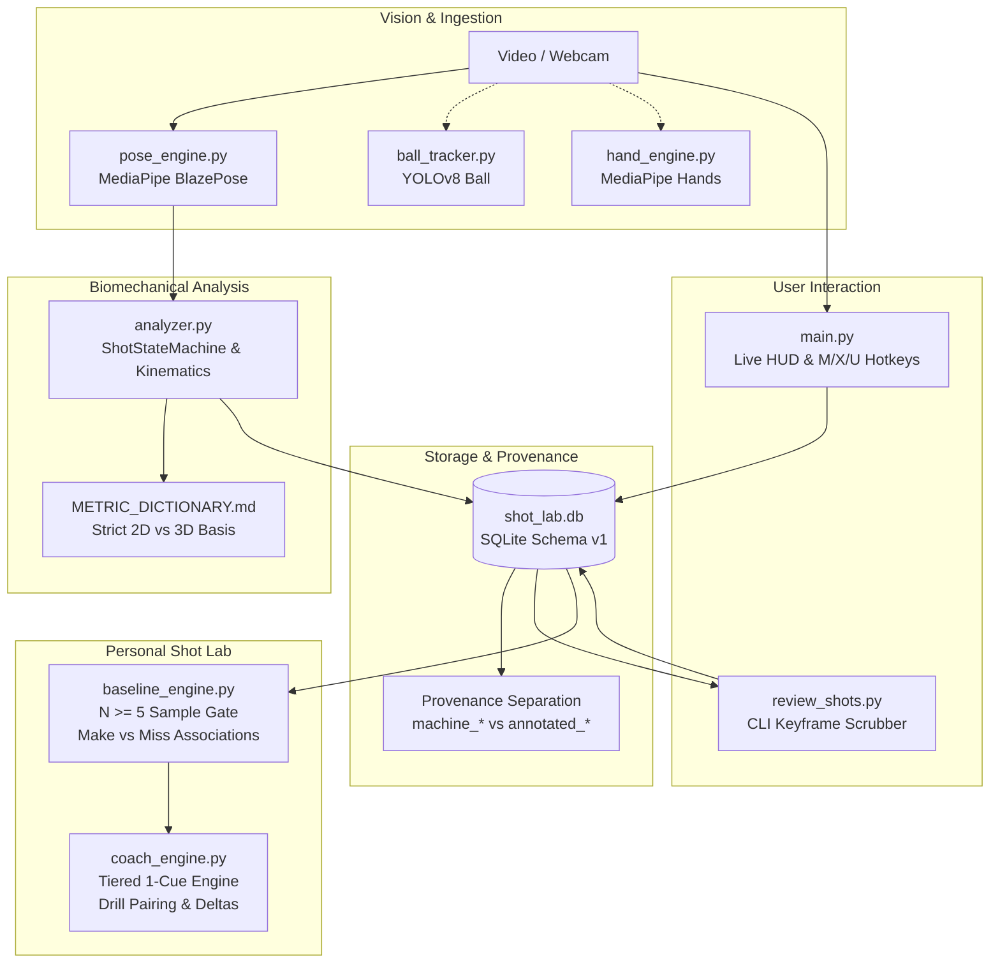

# Milestone Summary — v1.0: Reliable, Evidence-Backed Personal Shot Analysis

**Milestone:** v1.0 — Reliable, Evidence-Backed Personal Shot Analysis  
**Project:** Basketball Biomechanical Analysis & Personal Shot Lab  
**Date:** October 2026  
**Status:** Prototype features through Phase 4 implemented; field validation remains open. Shot-event performance is weak in the current small pilot, so Phase 5 UX is deferred behind the detector/review gate.  
**Target Audience:** Engineering Onboarding, Research Collaborators, Technical Reviewers  

---

## 1. Executive Overview

### 1.1 Product Vision
The Basketball Biomechanical Analysis project is an accessible, local-first computer vision and sports engineering tool. It empowers basketball players and coaches to understand repeatable personal shooting mechanics, correlate mechanics with shot outcomes (makes vs. misses), and practice deliberately with evidence-linked biomechanical feedback.

Unlike commercial tools that claim universal "optimal forms", produce opaque single-number "shot scores", or assert unvalidated causal diagnoses, this project operates on the principle of a **transparent Personal Shot Lab**:
- Prioritizes the player's personal baseline before illustrative comparisons.
- Enforces strict coordinate system purity (distinguishing 2D image-plane angles from monocular 3D world-coordinate estimates).
- Enforces conservative sample-size gates ($N \ge 5$) and abstains safely when data is missing or tracking is degraded.
- Reports descriptive statistical associations rather than unsubstantiated causal claims.

### 1.2 Core Capabilities Delivered in Milestone v1.0
1. **Live Video Capture & Tracking:** Webcam and prerecorded video processing via OpenCV and MediaPipe Tasks BlazePose (33 body landmarks, dual 2D/3D tracking, adaptive smoothing).
2. **Kinematic & Biomechanical Engine:** Discrete shot lifecycle state machine (`DIP` $\to$ `SET_POINT` $\to$ `RELEASE` $\to$ `FOLLOW_THROUGH`), joint angle extraction, proximal-to-distal kinetic sequencing lag calculation, and torso sway measurement.
3. **Measurement Integrity & Real-Video Benchmark:** Coordinate purity audit, metric dictionary definition (`METRIC_DICTIONARY.md`), qualification of public datasets (EPFL SportCenter, SPL Open Data, SHOT dataset), and real-video shooting pilot evaluation across development and held-out splits (`DATASET_EVAL_REPORT.json`).
4. **Personal Shot Lab Persistence & Provenance (`shot_lab_db.py`):** Schema-versioned SQLite database storing players, sessions, shots, baselines, and remediations while preserving raw machine detections alongside human review overrides.
5. **Interactive Review & Live Tagging:** Frictionless live hotkeys (`[M]` Make, `[X]` Miss, `[U]` Unknown) with HUD feedback in `main.py`, plus a dedicated CLI keyframe scrubber (`review_shots.py`).
6. **Individualized Baseline Engine (`baseline_engine.py`):** View- and shot-type-matched baseline calculation with sample statistics ($\bar{x} \pm s$), temporal quantization error disclosure ($\pm 33.3\text{ms}$ at 30 FPS), and make vs. miss descriptive associations.
7. **One-Cue Remediation Engine (`coach_engine.py`):** 3-tier hierarchical flaw prioritization (Kinetic Sequencing $\to$ Release Extension $\to$ Torso Sway), presenting at most one high-impact cue paired with a specific drill and follow-up delta tracking.

---

## 2. System Architecture

The project follows a modular, tracer-first layered architecture ensuring separation of concerns between vision inference, biomechanical calculations, data persistence, and coaching logic.



### 2.1 Architectural Components

| Module | Core Responsibility | Key Implementation Details |
| :--- | :--- | :--- |
| `pose_engine.py` | Monocular human pose tracking | Uses MediaPipe Tasks `PoseLandmarker`. Extracts 33 landmarks, normalized 2D image coordinates $(u, v)$, and model-estimated metric 3D world coordinates $(x, y, z)$ in meters. Applies Exponential Moving Average (EMA) smoothing ($\alpha = 0.5$). |
| `analyzer.py` | Kinematic analysis & shot state machine | Computes 3D joint angles using pure vector dot-products (`pt_3d`); extracts 2D angles separately. Detects shot phases (`DIP`, `SET_POINT`, `RELEASE`, `FOLLOW_THROUGH`). Gaps $\le 2$ frames ($\le 66\text{ms}$) interpolated; longer gaps invalidate shot metrics. |
| `shot_lab_db.py` | Relational persistence & data provenance | SQLite database (`schema_version = 1`). Enforces strict provenance: stores immutable machine boundaries (`machine_*_frame`) alongside editable review boundaries (`annotated_*_frame`). Stores player physical traits, sessions, baselines, and drill remediations. |
| `main.py` | Live capture application & HUD | Orchestrates capture, pose detection, HUD rendering, and keyboard events. Features a non-blocking 2.5s post-shot outcome prompt (`[M] Make \| [X] Miss \| [U] Unknown`) that stamps records with `outcome_source: "live_hotkey"`. Windows `cp1252`-safe ASCII HUD. |
| `review_shots.py` | Post-session audit & keyframe scrubber | Standalone CLI tool. Allows reviewing session shots, keyframes, inspecting kinematic trajectories, overriding make/miss labels, and updating event boundaries without overwriting machine predictions. |
| `baseline_engine.py` | Personalized baseline profiling | Groups shots by `(player_id, camera_view, shot_type)`. Requires $N_{\text{valid}} \ge 5$ shots with `tracking_confidence == "SUFFICIENT"`. Computes sample standard deviation ($\bar{x} \pm s$) and attaches temporal quantization uncertainty ($\pm \frac{1}{\text{FPS}}$). Emits descriptive make vs. miss associations. |
| `coach_engine.py` | Hierarchical One-Cue remediation | Implements the **One-Cue Rule** using a 3-tier biomechanical hierarchy (Sequencing $\to$ Release $\to$ Balance). Pairs the identified flaw with a concrete drill and verifies follow-up sets ($N \ge 3$) by computing post-drill deltas ($\Delta_{\text{metric}}$). |
| `ball_tracker.py` & `ball_geometry.py` | Optional ball & arc trajectory | YOLOv8 COCO ball detection, parabolic trajectory fitting, entry angle calculation. Abstains with `outcome: "unknown"` when detections or rim context are insufficient. |
| `pro_comparator.py` | Illustrative reference comparison | Dynamic Time Warping (DTW) against hand-authored reference curves (Curry, Thompson, Allen). Explicitly labeled as illustrative pedagogical examples, never as normative NBA ground truth. |

---

## 3. Phase Summary & Progression

| Phase | Title | Milestone Status | Exit Evidence & Artifacts |
| :--- | :--- | :--- | :--- |
| **Phase 1** | Core Capture and Vision | Implemented Prototype | Capture and pose code exist. Clean-install, asset behavior, and cross-platform claims still need reproducible environment evidence. |
| **Phase 2** | Shot Analysis Foundations | Implemented Prototype | Shot lifecycle state machine, kinetic sequencing lag calculation, illustrative DTW comparison against pro reference profiles, optional YOLO ball tracking, and CSV session logging. |
| **Phase 3** | Measurement Integrity & Real-Video Validation | **Prototype + pilot; validation open** | Synthetic regression and public-data geometry checks are distinct from the small project-video pilot. Current pilot event metrics are weak; full annotation coverage and broader player/view evidence remain required. |
| **Phase 4** | Personal Shot Lab & Evidence-Gated Coaching | **Implemented prototype; effectiveness unvalidated** | SQLite provenance, hotkeys, review queue, baseline/cue engines, and integration tests exist. Baselines must use human-confirmed events until detector reliability is established. |
| **Phase 5** | Session History, Reports, and Coach Experience | **Deferred behind Phase 3 gate** | Preserve durable records and correction provenance; defer dashboard, roster management, and UX polish until detector exit criteria pass or report shots are human-confirmed. |
| **Phase 6** | Advanced Research & Review Release | Planned | Planned: Multi-camera synchronization experiments, player-separated temporal model comparisons (LSTM vs. heuristics), coach-in-the-loop validation, and academic defense package. |

---

## 4. Key Architectural Decisions (ADRs)

1. **Strict Provenance Separation (Machine vs. Human):**
   - *Decision:* In `shot_lab.db`, shots store `machine_dip_frame`, `machine_release_frame`, etc., separately from `annotated_dip_frame`, `annotated_release_frame`, etc.
   - *Rationale:* Human review must never destroy algorithmic predictions. Preserving both allows future supervised retraining and rigorous algorithm vs. annotator error analysis.

2. **Coordinate-Basis Purity (Zero Fallback Mixing):**
   - *Decision:* `pt_3d` in `analyzer.py` strictly requires all joints to exist in MediaPipe metric world coordinates $(x, y, z)$. If any joint is missing, the calculation returns `None` or an explicit abstention state. It never silently substitutes 2D normalized image coordinates into 3D dot products.
   - *Rationale:* Normalized image space $(u, v \in [0, 1])$ has non-uniform metric aspect ratios and lacks depth, making mixed vector angles geometrically meaningless.

3. **Disagreement $\ne$ Ground-Truth Error:**
   - *Decision:* The divergence between 2D image-plane angles and 3D world-landmark estimates (reported at $\pm 19.7^\circ$ in the pilot) is estimate disagreement, not error against ground truth. Without independent ground truth, neither estimate is known to be closer to reality.
   - *Rationale:* Single-camera 3D world coordinates from MediaPipe are learned neural priors, not sensor-triangulated optical mocap measurements.

4. **Minimum Sample Gate ($N \ge 5$) & Abstention Policy:**
   - *Decision:* Personal baselines strictly refuse to compute statistics unless at least 5 valid shots (`tracking_confidence == "SUFFICIENT"`) exist for the exact same player, camera view, and shot type.
   - *Rationale:* High variance in small shot samples ($N < 5$) leads to misleading coaching cues and spurious statistical noise.

5. **Hierarchical "One-Cue Rule":**
   - *Decision:* `coach_engine.py` restricts feedback to exactly one primary cue at a time, selecting along a strict mechanical chain: Tier 1 (Kinetic Sequencing Lag $> 100\text{ms}$) $\to$ Tier 2 (Release Extension $< 150^\circ$) $\to$ Tier 3 (Torso Sway $> 12^\circ$).
   - *Rationale:* Motor learning science demonstrates that presenting athletes with multiple simultaneous biomechanical corrections causes cognitive paralysis and degrades mechanics.

6. **Descriptive Associations over Causal Claims:**
   - *Decision:* System language is strictly restricted to descriptive association (*"In your 8 reviewed shots, makes were associated with $158^\circ \pm 4^\circ$ elbow extension compared to $142^\circ \pm 7^\circ$ on misses"*). Causal verbs (*"caused your miss"*, *"will fix your shot"*) are banned across all reports and code.

7. **Separation of Validation Evidence:**
   - *Decision:* Synthetic regression results (`EVAL_REPORT.json`), public dataset checks (`PUBLIC_DATASETS_REPORT.json`), and project-recorded video benchmarks (`DATASET_EVAL_REPORT.json`) are stored and reported in distinct, non-aggregated artifacts.

---

## 5. Requirements Traceability Matrix

| Requirement ID | Description | Implementation Artifact | Validation Status | Evidence |
| :--- | :--- | :--- | :--- | :--- |
| **PR-1: Capture & Setup** | Accept webcam/video, actionable framing guidance, asset management. | `main.py`, `pose_engine.py` | **Prototype; setup evidence partial** | Code and setup guide exist; clean startup and cross-platform behavior need a reproducible clean-environment record. |
| **PR-2: Measurement Integrity** | Separate 2D/3D coordinates, short-gap interpolation ($\le 2$ frames), confidence gating. | `analyzer.py`, `METRIC_DICTIONARY.md` | **Implemented; scoped checks present** | Coordinate-basis checks and synthetic tests exist. They do not establish absolute pose accuracy; independent 3D ground truth is absent. |
| **PR-3: Shot Events & Biomechanics** | Detect lifecycle events (dip, set, release), reject non-shot gestures, sequence lag. | `analyzer.py`, `evaluate_pipeline.py` | **Not validated on field data** | Synthetic harness passes 5/5 programmed cases. Small real-video pilot reports 25% precision, 40% recall (F1 0.308), and 283.4 ms timing MAE. |
| **PR-4: Ball & Outcome Analysis** | Ball tracking, entry trajectory, handle missing rim, default to `unknown`. | `ball_tracker.py`, `ball_geometry.py` | **Prototype; coverage unmeasured** | Unknown fallback exists. Rim/outcome detection coverage and accuracy have not been established; M/X/U human labels remain the reliable current path. |
| **PR-5: Coaching & Personalization** | One cue per shot, drill pairing, baseline-first, non-causal language. | `coach_engine.py`, `baseline_engine.py` | **Software behavior tested; usefulness unvalidated** | Tests cover engine/workflow behavior. Shot inputs need human confirmation; coaching efficacy has not been measured. |
| **PR-6: Session & Shot Lab** | Versioned DB schema, live hotkeys, review queue, boundary adjustment. | `shot_lab_db.py`, `main.py`, `review_shots.py` | **Workflow tests pass; field use unvalidated** | SQLite schema and review workflow tests exercise software behavior, not review burden or boundary quality on a representative dataset. |
| **PR-7: Scientific Evaluation** | Separate synthetic vs. real benchmarks, participant holdout, honest error metrics. | `evaluate_dataset.py`, `evaluate_public_datasets.py` | **Partial; pilot is diagnostic** | Public geometry checks and project-video pilot reports exist. Complete input coverage, multi-player/view spread, and correction burden remain open. |
| **NFR-1: Reproducibility** | Documented setup, dependencies, explicit CLI evaluation commands. | `README.md`, `requirements.txt` | **Partial** | Commands are documented; reproduce from a clean environment and verify complete annotation coverage before claiming end-to-end reproducibility. |
| **NFR-2: Privacy** | Local-first processing, local SQLite storage, no mandatory cloud uploads. | `shot_lab_db.py` | **Implementation inspected; privacy audit open** | Local persistence is implemented; a complete data-flow/dependency audit has not been recorded. |
| **NFR-3: Performance** | Process 30 FPS video with non-blocking UI and lightweight database operations. | `pose_engine.py`, `main.py` | **Unverified** | No named-hardware throughput/latency benchmark is documented. |
| **NFR-4: Robustness** | Gracefully handle missing models, occlusions, and out-of-frame limbs. | `analyzer.py`, `pose_engine.py` | **Partial checks** | Synthetic imputation and occlusion cases exist; broader real-video robustness and missing-asset behavior need evidence. |
| **NFR-5: Maintainability** | Modular boundaries between vision, analysis, persistence, and UX. | Modular file architecture | **Design inspected; maintainability not fully measured** | Modules are separated by responsibility; no recorded import-cycle/static-analysis audit supports a blanket validation claim. |
| **NFR-6: Honest Reporting** | Defined metrics, units, source tags, and confidence disclaimers. | `METRIC_DICTIONARY.md`, reports | **Artifacts exist; claim audit open** | Metric definitions exist; verify each product/report claim against its source and evidence class. |

---

## 6. Technical Debt, Known Limitations & Risk Log

### 6.1 Real-World Detection Performance & Tuning Needs
As benchmarked in `DATASET_EVAL_REPORT.json` on the human-annotated single-player pilot:
- **Shot Event Precision & Recall:** Across 3 real clips (5 human-annotated shots), the automated shot state machine achieved:
  - **Precision:** 25.0%
  - **Recall:** 40.0% (F1 Score: 0.308)
  - **Mean Release Timing MAE:** 283.4 ms (~8.5 frames at 30 FPS)
- **Root Cause:** Real shooting videos exhibit non-shooting ball adjustments, gathering motions, and variable gather heights that trigger false-positive phase transitions in rigid heuristic thresholds.
- **Priority:** Detector reliability is the next work, ahead of Phase 5 dashboard/roster polish. First audit that every labeled frame was processed. Then compare configurable multi-signal gates using wrist height/vertical velocity, dip-to-rise order, and plausible duration; ball-hand proximity may be an optional cue only if YOLO coverage is measured. Missing ball detections are unknown, not evidence of no contact.
- **Evaluation additions:** Annotate more players and camera views; report per-player/view F1 and timing-error distributions, sample counts, and uncertainty when supported. Measure the human boundary correction rate, absolute boundary shift, and outcome relabel rate.
- **Timing interpretation:** At 30 FPS, one-frame quantization is about 33.3 ms. It is much smaller than the observed 283.4 ms MAE and does not explain it; state-machine/event timing is the priority for investigation.

### 6.2 Monocular 3D Depth Limitations
- **Issue:** MediaPipe world landmarks are estimated via a monocular neural depth prior trained on general body poses, not triangulated motion capture.
- **Measured Evidence:** The pilot reports 2D-versus-world estimate disagreement averaging $\pm 19.7^\circ$ (up to $40.8^\circ$ at the set point).
- **Status:** This is disagreement, not a measurement error estimate. No independent joint-angle ground truth establishes which estimate is closer. Avoid absolute-accuracy claims; even repeatability claims require stable capture and validated tracking.

### 6.3 Ball & Rim Trajectory Coverage
- **Issue:** Stock YOLOv8 COCO models track the ball (`sports ball` class) but lack basketball rim detection, causing parabolic trajectory fitting to yield `outcome: "unknown"` on standard video clips.
- **Status:** Mitigated in Phase 4 by frictionless human outcome labeling (Live Hotkeys `[M]`/`[X]` and Post-Session CLI review). Custom rim model training deferred to future research phases.

### 6.4 Lower-Body Framing Truncation
- **Issue:** In phone captures at close range (under 3 meters), jump shot takeoff often carries ankles or knees out of frame, triggering `INSUFFICIENT` confidence badges.
- **Guidance:** Documented in setup instructions: camera must be placed at 3.5m–4.5m distance at waist height to guarantee full-body coverage during elevation.

---

## 7. Getting Started & Verification Guide

### 7.1 Environment Setup
```bash
# 1. Clone repository and navigate to root
cd basketball_proj

# 2. Activate Python environment (Python 3.10+ recommended)
.\.venv\Scripts\Activate.ps1

# 3. Verify required dependencies
pip install -r requirements.txt
```

### 7.2 Running the Application Workflows

#### A. Live Capture with Outcome Tagging
```bash
# Run live webcam capture with outcome hotkeys ([M] Make | [X] Miss | [U] Unknown)
python main.py

# Or analyze a prerecorded video file
python main.py --video raw_clips/klay_vid.mp4
```

#### B. Post-Session Shot Review & Correction
```bash
# Launch interactive CLI review queue for the most recent session
python review_shots.py --latest

# Or review a specific session ID
python review_shots.py --session <session_uuid>
```

#### C. Personal Baseline & Coaching Recommendations
```bash
# Calculate baseline for default player ('player_default') on side-view catch-and-shoots
python -c "from baseline_engine import calculate_player_baseline, print_baseline_report; r = calculate_player_baseline('player_default', 'side_90', 'catch_and_shoot'); print_baseline_report(r)"

# Evaluate One-Cue remediation and recommended drill
python -c "from coach_engine import evaluate_remediation; rem = evaluate_remediation('player_default', 'side_90', 'catch_and_shoot'); print(rem)"
```

### 7.3 Executing Verification & Evaluation Suites

```bash
# 1. Run all Shot Lab integration and unit tests (100% pass)
python test_shot_lab_db.py
python test_baseline_engine.py
python test_coach_engine.py
python test_shot_lab_flow.py

# 2. Run deterministic synthetic regression harness (5/5 scenarios)
python evaluate_pipeline.py

# 3. Run public dataset benchmarks (EPFL & SPL evaluations)
python evaluate_public_datasets.py

# 4. Run real-video single-player pilot benchmark against human annotations
python evaluate_dataset.py
```

---

## 8. Milestone Conclusion & Next Work

The repository contains a substantial prototype and useful measurement safeguards. Current shot-event pilot performance is not strong enough to support automated baselines or claims of dependable coaching. Treat synthetic tests as software regression checks and real-video numbers as small-pilot diagnostics.

**Immediate Next Steps (Phase 3 detector/review gate):**
1. Audit evaluator frame coverage and annotation matching before accepting pilot metrics.
2. Diagnose false positives/misses; measure candidate event gates on annotated development clips and keep held-out players/views untouched.
3. Expand annotations across players/views and report per-group spread and sample counts.
4. Record human boundary/outcome corrections while preserving machine detections.
5. Allow Phase 5 reports only for human-confirmed shots until the detector passes an agreed, evidence-backed reliability threshold. Keep M/X/U outcome hotkeys as the deliberate fallback unless a rim model has demonstrated useful coverage.
